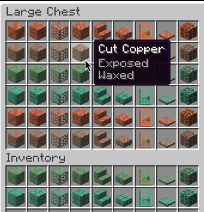

# Copper Tooltips

A very simple mod that changes the names of copper blocks to the basic name of the block
and adds the oxidation level and whether they're waxed to the tooltip.

## License

This mod is available under the MIT license. See [LICENSE](LICENSE) for more info.